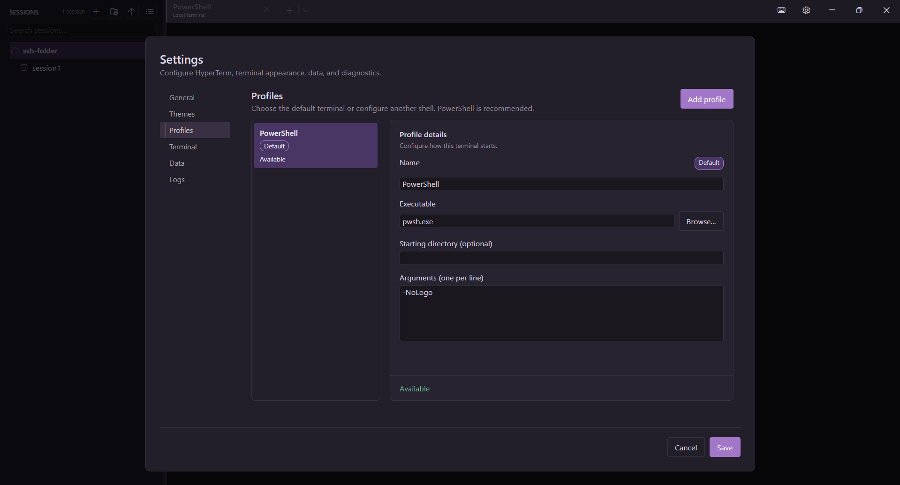

<p align="center">
  
</p>

<h1 align="center">HyperTerm</h1>

<p align="center">
  A Windows terminal and SSH session manager built with .NET, Avalonia, and xterm.js.
</p>

HyperTerm combines local terminal profiles, saved SSH connections, and optional
persistent psmux sessions in one focused desktop application. PowerShell is the
recommended default, while custom profiles can launch other shells and tools.

## Preview

### Split panes

Run independent terminals side by side inside the same tab. Panes support
horizontal and vertical layouts, draggable dividers, directional keyboard
navigation, and a subtle active-pane indicator.


### SSH session manager

Search and sort saved SSH connections, edit connection details, and assign
sessions to folders without storing passwords or other credentials.


### Local terminal profiles

Choose the default shell and configure its executable, arguments, and starting
directory. Additional profiles can launch other local shells and tools.



## Highlights

- Configurable local terminal profiles with a selectable default
- Saved SSH sessions organized in nested folders
- Multiple isolated tabs with editable titles
- Recursive horizontal and vertical split panes with independent terminals
- Persistent psmux sessions with attach, detach, and shutdown controls
- Terminal output search and command palette
- Built-in stable release updates with SHA-256 package verification
- Configurable font, cursor, and selection appearance
- WebGL-accelerated xterm.js renderer with DOM fallback
- Local SQLite storage with no remote telemetry

HyperTerm uses the installed Windows OpenSSH client and never stores passwords
or other SSH credentials.

## Requirements

- Windows 10 or Windows 11
- [.NET SDK 10](https://dotnet.microsoft.com/download/dotnet/10.0) or newer
- [Node.js](https://nodejs.org/) with npm
- Microsoft Edge WebView2 Runtime
- PowerShell for the recommended default profile
- Windows OpenSSH Client (`ssh.exe`) for SSH sessions

[psmux](https://github.com/psmux/psmux) is bundled in complete release packages.
Development builds can also resolve `psmux.exe` from `PATH`.

## Run from source

From the repository root:

```powershell
.\scripts\bootstrap.ps1
```

This installs web terminal dependencies, builds HyperTerm in Release mode, and
starts the generated executable. To build without launching:

```powershell
.\scripts\bootstrap.ps1 -BuildOnly
```

## Install HyperTerm

Download `HyperTerm-<version>-win-x64-setup.exe` from the GitHub release and run
it as the current user. The installer does not request administrator access and
places the application under `%LOCALAPPDATA%\Programs\HyperTerm`. It creates a
Start Menu shortcut and offers an optional desktop shortcut.

The uninstaller removes the application and shortcuts. Interactive uninstall
also offers to remove saved sessions, settings, update files, and logs; choosing
No, or running a silent uninstall, preserves that data.

The installer is currently unsigned, so Windows SmartScreen may identify its
publisher as unknown. Verify the adjacent `.sha256` file when downloading a
release. The portable ZIP remains available for users who prefer it.

## Build a release

Create the self-contained Windows release ZIP and x64 per-user installer:

```powershell
.\scripts\build.ps1
```

Output is written under `artifacts\releases\`. Both packages include the .NET
runtime, native libraries, web terminal assets, and verified psmux binary. The
build downloads a pinned, verified Inno Setup compiler into the ignored
`artifacts\cache\` directory when needed. ARM64 builds continue to produce only
the portable ZIP.

## Verify changes

Run the local quality gate:

```powershell
.\scripts\verify.ps1
```

Use `-Package` to also build and validate the release ZIP, or `-Coverage` to run
the coverage-enforcing checks used by CI.

## Local data

HyperTerm stores its data under `%LocalAppData%\HyperTerm\`:

```text
hyperterm.db   Saved sessions and folders
settings.json Application, profile, and appearance settings
updates\      Verified update download and staging cache
```

Settings writes are atomic, imported archives are validated before mutation,
and diagnostics remain local without capturing terminal input or credentials.

## Architecture

```text
Avalonia UI -> one WebView2 per tab -> xterm.js pane instances
            -> C# bridge -> independent ConPTY sessions -> shell / ssh.exe
```

The solution follows a simplified Clean Architecture split across
`HyperTerm.Core`, `HyperTerm.Infrastructure`, and `HyperTerm.UI`. See the
[architecture guide](docs/architecture.md) for project boundaries and terminal
lifecycle details.

## Technology

.NET 10, Avalonia UI 12, CommunityToolkit.Mvvm, Entity Framework Core, SQLite,
Porta.Pty, Windows ConPTY, WebView2, xterm.js, PowerShell, OpenSSH, and psmux.
